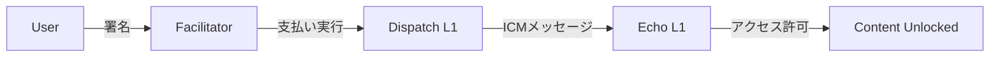

# 🔐 x402 Paywall DApp

> **次世代クロスチェーン有料コンテンツ配信プラットフォーム**
> Avalanche ICM × ERC-3009 × HTTP 402 Protocol

[](https://opensource.org/licenses/MIT)
[](https://soliditylang.org/)
[](https://www.typescriptlang.org/)
[](https://nodejs.org/)
[](https://www.docker.com/)

---

## 📖 目次

- [概要](#-概要)
- [主な機能](#-主な機能)
- [アーキテクチャ](#-アーキテクチャ)
- [クイックスタート](#-クイックスタート)
- [MVP更新手順](#-mvp更新手順)
- [ドキュメント](#-ドキュメント)
- [ロードマップ](#-ロードマップ)
- [貢献](#-貢献)
- [ライセンス](#-ライセンス)

---

## 🎯 概要

**x402 Paywall DApp**は、Avalanche Interchain Messaging (ICM)を活用したクロスチェーン有料コンテンツ配信システムです。

### なぜこのプロジェクトが必要か？

従来のWeb3コンテンツマネタイゼーションの課題：
- ❌ **ガス代の負担**: ユーザーが毎回ガス代を支払う必要がある
- ❌ **複雑なUX**: ウォレット操作が煩雑で離脱率が高い
- ❌ **単一チェーン制約**: 支払いとコンテンツが同じチェーンに縛られる

### このプロジェクトの解決策

- ✅ **ガス代不要**: ERC-3009でユーザーは署名するだけ
- ✅ **シンプルUX**: HTTP 402プロトコルで既存Webフローに統合
- ✅ **クロスチェーン**: 支払い(Dispatch L1) ⇄ アクセス制御(Echo L1)

---

## ✨ 主な機能

### 🔑 クロスチェーンアクセス制御



- **Dispatch L1**: ERC-3009支払いトークン、支払い記録
- **Echo L1**: コンテンツアクセス管理（唯一の真実の情報源）
- **Avalanche ICM**: TeleporterMessengerでチェーン間通信

### 💸 ガス代不要の支払い (ERC-3009)

```typescript
// ユーザー: 署名するだけ（ガス代0）
const signature = await wallet.signTypedData(typedData);

// Facilitator: 代わりにガス代を支払って実行
await token.transferWithAuthorization(
  from, to, value, validAfter, validBefore, nonce,
  signature.v, signature.r, signature.s
);
```

### 🌐 HTTP 402 Protocol

```bash
# アクセス権なし → 402 Payment Required
curl -H "X-BUYER-ADDRESS: 0xABC..." \
     http://localhost:4000/api/content/premium-guide

HTTP/1.1 402 Payment Required
X-PAYMENT: {"tokenAddress":"0x...","amount":"1000000000000000000",...}

# 支払い後 → 200 OK + Content URL
HTTP/1.1 200 OK
{"contentUrl": "https://example.com/premium-guide.pdf"}
```

### 🐳 Docker-First Architecture

```bash
# ワンコマンドで全サービス起動
docker-compose up -d

# Backend, Facilitator, Frontend, Relayerすべて起動
```

---

## 🏗️ アーキテクチャ

```
┌─────────────┐
│   Browser   │
└──────┬──────┘
       │ x402 Protocol
       v
┌─────────────────────────────────────┐
│  Backend (Port 4000)                │
│  - Content API                       │
│  - Access Checker (Echo Chain)       │
└────────────┬────────────────────────┘
             │
    ┌────────┴────────┐
    v                 v
┌─────────┐     ┌──────────────┐
│Echo L1  │     │Dispatch L1   │
│         │ ←ICM│              │
│Access   │     │Payment       │
│Control  │     │Registry      │
└─────────┘     └──────┬───────┘
                       │
                ┌──────┴──────┐
                v             v
        ┌──────────┐  ┌──────────────┐
        │ERC3009   │  │Facilitator   │
        │Token     │  │(Port 5000)   │
        └──────────┘  └──────────────┘
```

### 技術スタック

| Layer | Technology |
|-------|-----------|
| **Smart Contracts** | Solidity 0.8.20, Hardhat, OpenZeppelin |
| **Backend** | Node.js 20, TypeScript 5, Express |
| **Blockchain** | ethers.js v6, Avalanche ICM |
| **Infrastructure** | Docker, Docker Compose, Bun |

詳細は [Architecture Documentation](./docs/architecture.md) を参照。

---

## 🚀 クイックスタート

### 前提条件

- Node.js 20+
- Bun 1.2+
- Docker 20+
- Git

### インストール

```bash
# 1. リポジトリをクローン（モノレポのルートから）
git clone https://github.com/your-org/avalanche-sample.git
cd avalanche-sample/icm-x402

# 2. 依存関係をインストール
cd contracts && bun install
cd ../backend && bun install
cd ../facilitator && bun install
cd ..  # icm-x402に戻る

# 3. 環境変数を設定（モノレポルートで実行）
cd ..  # avalanche-sampleルートに移動
cp .env.example .env
# .envファイルを編集してRPC URLとアドレスを設定

# 4. スマートコントラクトをデプロイ
cd icm-x402/contracts
bun run deploy  # Testnetにデプロイ

# 5. サービスを起動（icm-x402ディレクトリで実行）
cd ..  # icm-x402ディレクトリに戻る
docker-compose up -d --build
```

**重要**:
- `.env`ファイルは**ルート直下**（`/avalanche-sample/.env`）に配置
- `docker-compose up -d --build` は **`icm-x402/`ディレクトリ内**で実行

### 動作確認

```bash
# Health check
curl http://localhost:4000/health
curl http://localhost:5000/health

# コンテンツ一覧
curl http://localhost:4000/api/content

# アクセス権確認（402レスポンス）
curl -H "X-BUYER-ADDRESS: 0xYourAddress" \
     http://localhost:4000/api/content/premium-guide-avalanche-icm
```

詳細は [Deployment Guide](./docs/deployment.md) を参照。

---

## 🔄 MVP更新手順

このプロジェクトは**MVP（最小実行可能製品）**として30タスクが完了しています。

### 現在の実装状況

✅ **Phase 1**: セットアップ (T001-T010)
✅ **Phase 2**: 基盤構築 - コントラクト、Docker、RPC (T011-T024)
✅ **Phase 3**: ユーザーストーリー1 - 有料コンテンツアクセス (T025-T030)
✅ **Phase 4**: ユーザーストーリー2 - ガス代不要の支払い (T031-T041)

⏳ **Phase 5**: フロントエンド UI (T042-T051)
⏳ **Phase 6**: 開発環境 (T052-T056)
⏳ **Phase 7**: デバッグツール (T057-T060)
⏳ **Phase 8**: 磨き上げ (T061-T070)

### MVPから最新版への更新

```bash
# 1. ルートディレクトリに移動
cd /path/to/avalanche-sample

# 2. 最新コードを取得
git pull origin main

# 3. 依存関係を更新
cd icm-x402/contracts && bun install
cd ../backend && bun install
cd ../facilitator && bun install
cd ../..  # ルートに戻る

# 4. 環境変数の確認（ルート直下の.env）
# 新しい変数が追加されていないか .env.example と比較
diff .env .env.example

# 5. コントラクトの再デプロイ（破壊的変更がある場合）
cd icm-x402/contracts
bun run deploy

# 6. サービスの再起動
cd ..  # icm-x402に戻る
docker-compose down
docker-compose up -d --build
```

**重要**: `.env`ファイルは**ルート直下**（`/avalanche-sample/.env`）にあります。

### 破壊的変更の確認

```bash
# CHANGELOGを確認
cat CHANGELOG.md

# または特定バージョン間の差分
git diff v1.0.0..v1.1.0
```

### トラブルシューティング

問題が発生した場合：

1. **ログ確認**:
   ```bash
   docker-compose logs -f backend
   docker-compose logs -f facilitator
   ```

2. **クリーンビルド**:
   ```bash
   docker-compose down -v  # ボリュームも削除
   docker-compose build --no-cache
   docker-compose up -d
   ```

3. **コントラクトアドレスの更新**:
   ```bash
   # .envファイルのアドレスが最新か確認
   grep "CONTENT_ACCESS_MANAGER_ADDRESS" backend/.env
   ```

詳細は [Development Guide](./docs/development.md) を参照。

---

## 📚 ドキュメント

| Document | Description |
|----------|-------------|
| [Architecture](./docs/architecture.md) | システムアーキテクチャ、データフロー |
| [API Specification](./docs/api-specification.md) | REST API リファレンス |
| [Smart Contracts](./docs/smart-contracts.md) | コントラクト仕様、セキュリティ分析 |
| [Deployment Guide](./docs/deployment.md) | デプロイ手順、トラブルシューティング |
| [Development Guide](./docs/development.md) | 開発環境構築、コーディング規約 |
| [Constitution](./docs/constitution.md) | プロジェクト憲法、8つの原則 |
| [Specification](./docs/specify.md) | 機能仕様、ユーザーストーリー |

---

## 🗺️ ロードマップ

### ✅ Phase 1-3: MVP (完了)
- [x] スマートコントラクト3件
- [x] Backend API (x402プロトコル)
- [x] Facilitator基礎（RPC client）
- [x] Docker環境

### 🔨 Phase 4: Gasless Payment (進行中)
- [ ] Facilitator API実装
- [ ] ERC-3009トランザクション送信
- [ ] PaymentRegistry統合

### ⏳ Phase 5: Frontend UI (計画中)
- [ ] Next.js UI
- [ ] ウォレット接続 (MetaMask/Core)
- [ ] コンテンツブラウジング
- [ ] 支払いフロー

### ⏳ Phase 6-7: DevOps & Tools
- [ ] Docker Compose完全版
- [ ] Relayerサービス
- [ ] デバッグAPI

### ⏳ Phase 8: Polish
- [ ] UI/UXブラッシュアップ
- [ ] テストカバレッジ90%+
- [ ] ドキュメント完全版
- [ ] 監査準備

### 🔮 Future (v2.0+)
- [ ] Multi-token support (USDC, AVAX等)
- [ ] Subscription model (定期購読)
- [ ] Content CDN integration
- [ ] Analytics dashboard
- [ ] Mobile app (React Native)

---

## 🤝 貢献

貢献を歓迎します！以下の手順に従ってください：

### 1. Issueを作成
バグ報告または機能リクエストを[Issues](https://github.com/your-org/icm-x402-paywall/issues)に投稿。

### 2. Forkしてブランチ作成

```bash
# Fork後、クローン
git clone https://github.com/YOUR_USERNAME/icm-x402-paywall.git

# ブランチ作成
git checkout -b feature/your-feature-name
```

### 3. 実装・テスト

```bash
# テスト実行
bun run test

# Lint
bun run lint
```

### 4. Pull Request

- [Development Guide](./docs/development.md)のコーディング規約に従う
- 意味のあるコミットメッセージ
- テストカバレッジを維持

### コントリビューター

<a href="https://github.com/your-org/icm-x402-paywall/graphs/contributors">
  
</a>

---

## 🛡️ セキュリティ

セキュリティ脆弱性を発見した場合は、公開Issueではなく[security@example.com](mailto:security@example.com)に直接ご連絡ください。

### 監査状況
- [ ] 内部監査完了
- [ ] 外部監査予定
- [ ] バグバウンティプログラム検討中

---

## 📄 ライセンス

このプロジェクトは [MIT License](./LICENSE) の下で公開されています。

```
MIT License

Copyright (c) 2025 x402 Paywall Contributors

Permission is hereby granted, free of charge, to any person obtaining a copy
of this software and associated documentation files (the "Software"), to deal
in the Software without restriction...
```

---

## 📞 サポート & コミュニティ

- **GitHub Discussions**: [質問・議論](https://github.com/your-org/icm-x402-paywall/discussions)
- **Discord**: [コミュニティサーバー](https://discord.gg/your-server)
- **Twitter**: [@x402paywall](https://twitter.com/x402paywall)
- **Email**: [hello@example.com](mailto:hello@example.com)

---

## 🙏 謝辞

このプロジェクトは以下の技術・プロジェクトに支えられています：

- [Avalanche](https://www.avax.network/) - Interchain Messagingプラットフォーム
- [OpenZeppelin](https://www.openzeppelin.com/) - セキュアなスマートコントラクトライブラリ
- [Hardhat](https://hardhat.org/) - Ethereum開発環境
- [ethers.js](https://docs.ethers.org/) - Ethereum JavaScript SDK

---

<p align="center">
  Made with ❤️ by the x402 Paywall Team
</p>

<p align="center">
  <a href="https://github.com/your-org/icm-x402-paywall">⭐ Star on GitHub</a> •
  <a href="https://github.com/your-org/icm-x402-paywall/issues">🐛 Report Bug</a> •
  <a href="https://github.com/your-org/icm-x402-paywall/issues">💡 Request Feature</a>
</p>
