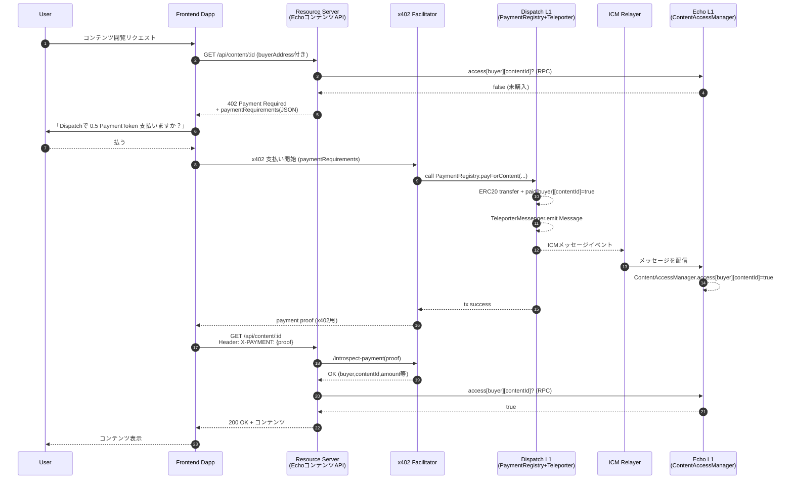

## 1. ゴールと全体コンセプト

* **支払いチェーン**：Dispatch（Avalanche L1 テストネット）

* **コンテンツチェーン**：Echo（Avalanche L1 テストネット）
  → Avalanche Academy でも Fuji / Echo / Dispatch を ICM＋Interchain Token Transfer の教材チェーンとして使う前提になっています。

* **支払いプロトコル**：x402（HTTP 402 + ステーブルコイン/ ERC20 決済）

* **クロスチェーンメッセージング**：Avalanche ICM / Teleporter（Dispatch ↔ Echo 間）。

ユーザー体験としては：

1. ユーザーが Echo 上のコンテンツを見にいく（Dapp のフロントから）
2. バックエンドは「まだ支払いしていない」と判定 → HTTP 402 + x402 情報を返す
3. フロント側 x402 クライアントが Dispatch 上で支払いトランザクションを投げる
4. Dispatch の PaymentRegistry が Teleporter を通じて Echo の ContentAccessManager に ICM メッセージを送信
5. Echo のコントラクトが「このユーザーはこのコンテンツの支払い済み」と記録
6. バックエンドがそれを確認し、コンテンツを返す

---

## 2. チェーン & トークンの前提

### 2-1. チェーン

* **Dispatch L1（Testnet）**

  * 役割：支払い実行、PaymentRegistry 配置
* **Echo L1（Testnet）**

  * 役割：コンテンツアクセス権のソース・オブ・トゥルース（ContentAccessManager 配置）

Fuji C-Chain / Echo / Dispatch の 3 チェーンで Interchain Token Transfer & ICM を学ぶコースが公式に用意されているので、Dispatch/Echo をテストに使うのはかなり自然な選択です。

Builder Hub + Core Wallet を使うと、C-Chain, Dispatch, Echo などのテストトークンが自動配布される仕組みもあります。

### 2-2. トークン

* 支払い用に、Dispatch 上の **ERC20 PaymentToken（例：USDC テストトークン）** を想定
* Echo 側は、「支払い済み情報」だけ持てばよいので、PaymentToken 自体を Echo にブリッジしなくても OK（ブリッジしたいなら Interchain Token Transfer を併用）。

---

## 3. オフチェーン構成

### 3-1. フロントエンド（Next.js / React 想定）

**役割**

* ユーザーのウォレット（Core / MetaMask）を Dispatch に接続
* x402 クライアント SDK を使って

  * 402 レスポンス検知
  * ウォレットでの支払い
  * `X-PAYMENT` 付きでリトライ

**主な技術**

* Wallet 接続：`wagmi + viem` など（RPC は Dispatch L1）
* x402 クライアント：

  * `@coinbase/x402` コア SDK
  * `x402-fetch` などの fetch wrapper を利用（Base 用に作られているが、x402 はチェーン非依存仕様なので Dispatch の RPC に向けて使える）

### 3-2. バックエンド（Resource Server）

**役割**

* 隠しコンテンツの API (`GET /api/content/:id`)
* x402 の Seller（有料リソース提供者）ロジック
* Echo 上の `ContentAccessManager` を読んでアクセス権チェック

**技術**

* Node.js + Express
* `x402-express` ミドルウェアで 402 レスポンス生成＆`X-PAYMENT` 検証ロジックを楽にする
* Avalanche Data API / Avalanche TypeScript SDK で Echo チェーンを読み取り

### 3-3. x402 Facilitator サービス

**役割**

* クライアントから送られてきた支払い情報（txHash / 署名）を検証
* Dispatch RPC を叩いて PaymentRegistry を呼び出し
* Payment が正しく実行された証拠を生成し、クライアント・サーバに返す

**構成例**

* Node.js or Rust
* x402 の公式 Facilitator 実装をカスタムネットワーク（Dispatch RPC）に向ける形で利用
  （x402 プロトコル自体はチェーン非依存なので、RPC とチェーン ID を差し替えれば Avalanche L1 でも概念上は利用可能）

### 3-4. ICM Relayer

**役割**

* Dispatch の TeleporterMessenger イベントを監視
* メッセージを Echo の TeleporterMessenger に中継（ICM）

Avalanche の Interchain Token Transfer コースでも、「ICM を動かすには Relayer を自前で動かす必要がある」と明記されています。

---

## 4. オンチェーン構成（スマートコントラクト）

### 4-1. PaymentRegistry（Dispatch L1）

**目的**

* x402 支払いのオンチェーン窓口
* 支払い完了と同時に ICM メッセージを Echo に送信

**主な責務**

* `payForContent(contentId)` のような関数を公開
* `ERC20PaymentToken.transferFrom(buyer, merchant, amount)` を実行
* `paid[buyer][contentId] = true` を記録
* TeleporterMessenger に対して Cross-chain message を送信

```solidity
contract PaymentRegistry {
    IERC20 public paymentToken;
    address public teleporterMessenger;
    address public contentAccessManagerOnEcho;

    mapping(address => mapping(bytes32 => bool)) public paid;

    function payForContent(bytes32 contentId, uint256 amount) external {
        // 1. ERC20 受け取り
        paymentToken.transferFrom(msg.sender, merchant, amount);

        // 2. Dispatch 側のローカル記録
        paid[msg.sender][contentId] = true;

        // 3. Echo に向けた ICM メッセージを Teleporter に送信
        bytes memory message = abi.encode(msg.sender, contentId, amount);
        ITeleporterMessenger(teleporterMessenger).sendCrossChainMessage(
            echoChainId,
            contentAccessManagerOnEcho,
            message,
            feeToken,
            feeAmount
        );
    }
}
```

※ 実際には `icm-contracts` の TeleporterMessenger インターフェースに従う必要があります。

### 4-2. ContentAccessManager（Echo L1）

**目的**

* 「どのユーザーがどのコンテンツを閲覧可能か」のファイナルな真実を保持
* ICM メッセージを受信して `access[buyer][contentId] = true` を更新

```solidity
contract ContentAccessManager is ITeleporterReceiver {
    mapping(address => mapping(bytes32 => bool)) public access;

    function receiveTeleporterMessage(
        bytes32 sourceChainId,
        address originSender,
        bytes calldata message
    ) external override {
        // TeleporterMessenger 本人からのみ呼べるようチェック

        (address buyer, bytes32 contentId, uint256 amount) =
            abi.decode(message, (address, bytes32, uint256));

        // 必要なら sourceChainId / originSender 検証
        access[buyer][contentId] = true;
    }
}
```

Teleporter / ICM の受信側コントラクトパターンは `icm-contracts` リポジトリのサンプルとほぼ同じ構造です。

---

## 5. エンドツーエンドのフロー（Dispatch × Echo × x402）

### 5-1. 高レベルシーケンス（mermaid）



---

## 6. HTTP / x402 レベルの仕様イメージ

### 6-1. 402 レスポンスの JSON（例）

```jsonc
// GET /api/content/:id の 1回目レスポンス
HTTP/1.1 402 Payment Required
Content-Type: application/json

{
  "x402Version": 1,
  "paymentRequirements": [
    {
      "network": "avalanche-dispatch-testnet",
      "tokenAddress": "0xPaymentTokenOnDispatch",
      "amount": "0.5",
      "recipient": "0xMerchantAddressOnDispatch",
      "reference": "content:<id>"
    }
  ],
  "facilitator": "https://facilitator.yourapp.example/x402"
}
```

* `network` はクライアント側で viem のチェーン定義や RPC URL にマッピングさせる
* `reference` にコンテンツ ID を含めることで、PaymentRegistry & Facilitator が「どのコンテンツの支払いか」を確実に紐づけ

### 6-2. X-PAYMENT ヘッダ（論理イメージ）

```http
X-PAYMENT: {
  "network": "avalanche-dispatch-testnet",
  "txHash": "0x...",
  "buyer": "0xBuyer",
  "contentId": "content:<id>",
  "signature": "facilitator-signed-proof"
}
```

Resource Server は、`x402-express` などのミドルウェアを使って `X-PAYMENT` の有効性確認を Facilitator に委譲できます。

---

## 7. 実装フェーズ案（ざっくり）

1. **単一チェーン x402 プロトタイプ（Dispatch のみ）**

   * Dispatch 上に PaymentRegistry(簡易版)をデプロイ（Teleporter 呼び出しなし）
   * Backend は `x402-express` で 402 & X-PAYMENT 検証
   * Frontend は `x402-fetch + viem` で 402 → 支払い → リトライのループを実装

2. **ICM 対応（Dispatch → Echo）**

   * PaymentRegistry に Teleporter 呼び出し追加
   * Echo に ContentAccessManager をデプロイ
   * ICM Relayer を構築し、Dispatch ↔ Echo の Teleporter メッセージを中継

3. **Access 判定を Echo 側に寄せる**

   * Backend が Echo の `access[buyer][contentId]` を見るように変更
   * 必要なら、「支払い完了しているが ICM 反映待ち」の状態に対してリトライポリシー（数秒ポーリング or エラー文言）を定義

---

## 8. ここまでの設計のポイント

* **x402 は HTTP レイヤー、ICM はチェーン間レイヤー**
  → x402 で「Dispatch への支払いを要求」し、ICM で「支払い済み情報を Echo に同期」する、という役割分担。
* **Dispatch = 支払いの責任チェーン、Echo = 権限管理チェーン**
  → どのコンテンツに誰がアクセスできるかは、Echo の `ContentAccessManager` が最終決定。
* **サーバ & フロントは x402 SDK 群 + Avalanche SDK を使って薄く書く**

  * フロント：`x402-fetch / @coinbase/x402 / viem`
  * サーバ：`x402-express` ミドルウェア
  * チェーン：`@avalanche-sdk/interchain` など（必要なら）